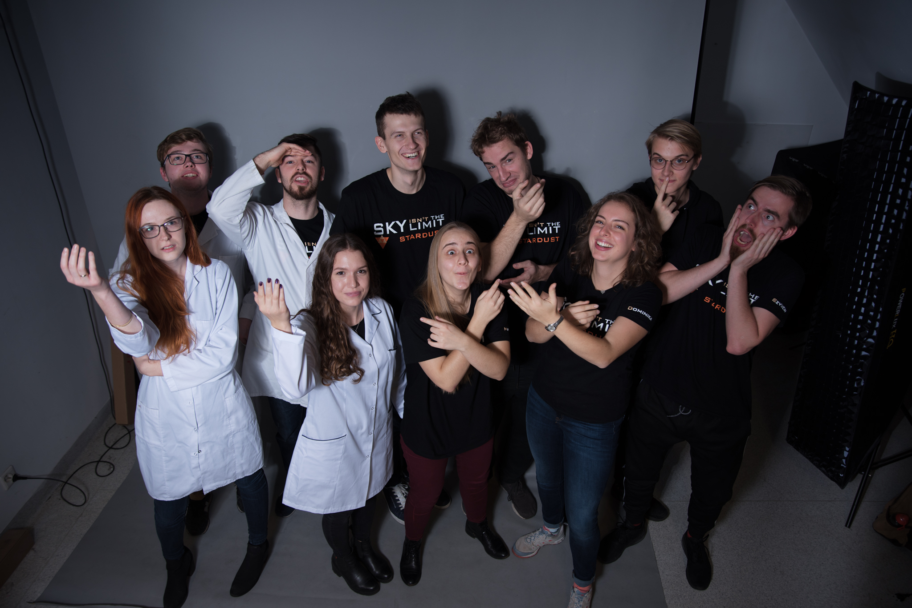
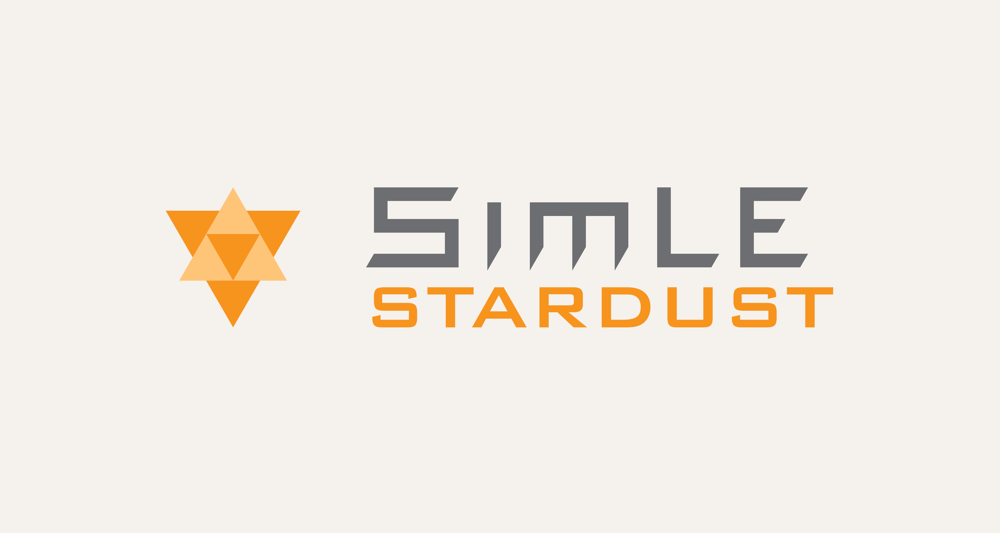

### About us 

STARDUST Microbiology Project is a joint venture of two Gdańsk University of Technology science clubs: SimLE and KSB (Student Club of Biotechnology). We are group of 10 students from Gdańsk University of Technology in Poland participating in the REXUS/BEXUS programme. Our project aims to conduct qualitative and quantitative research of microbial life in the stratosphere. 

 

