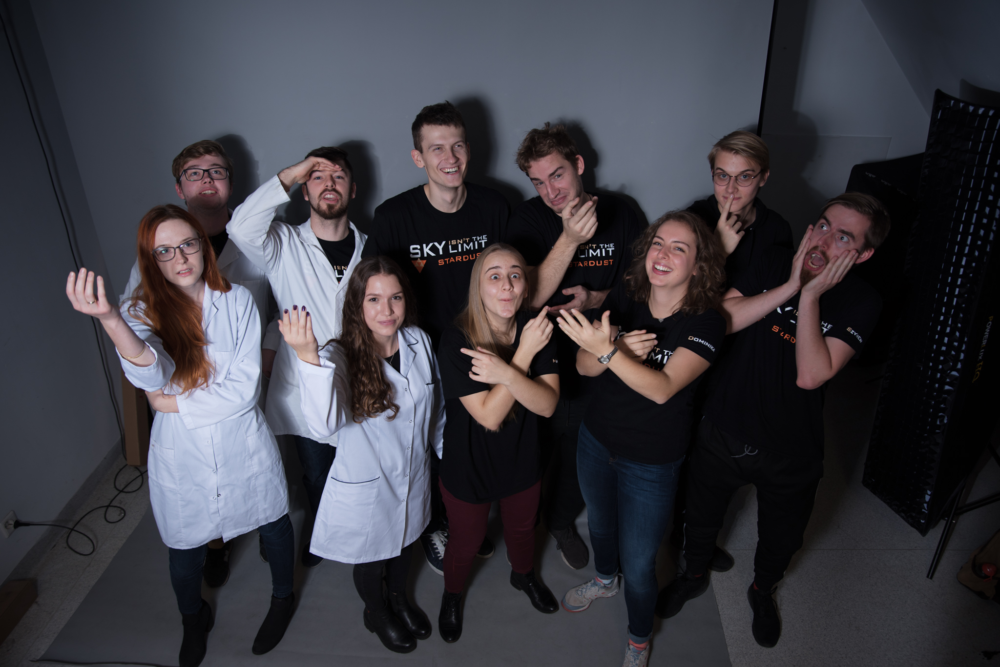
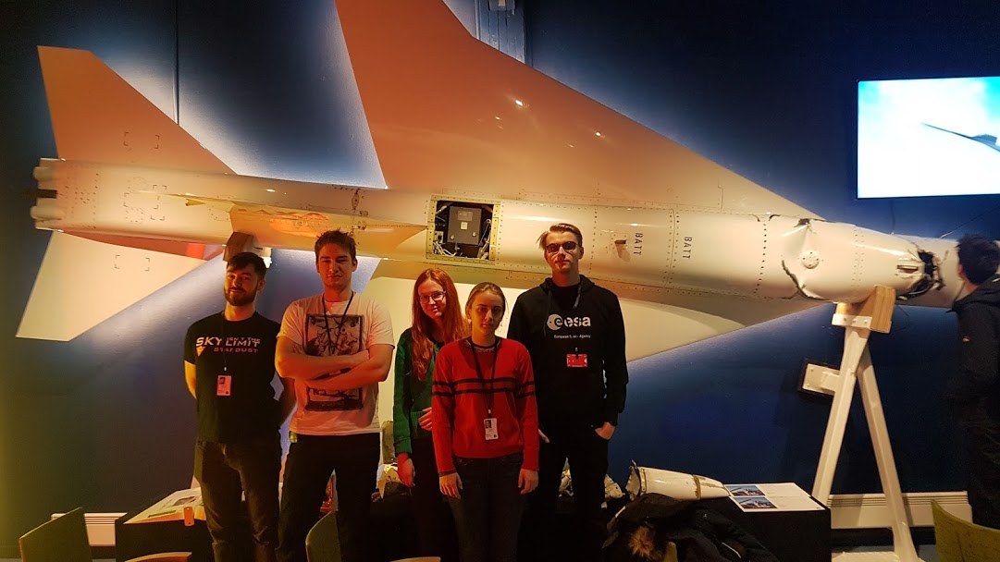
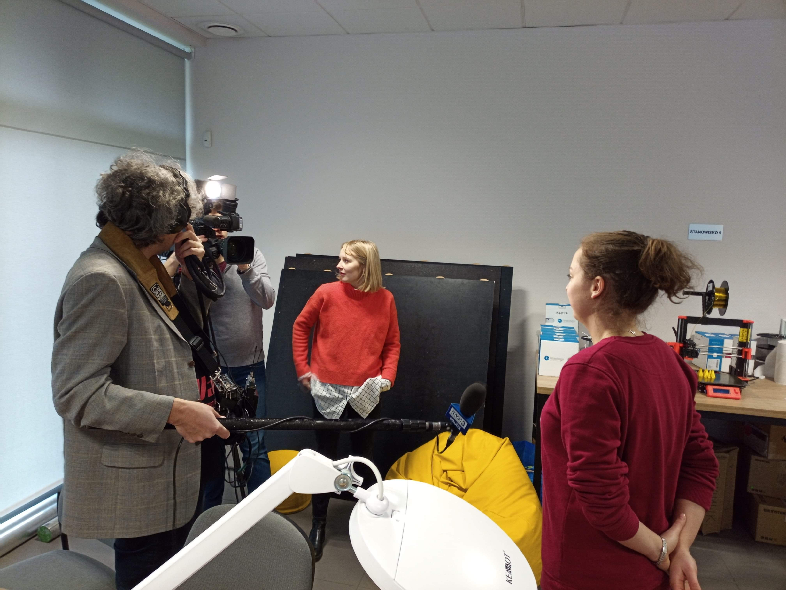
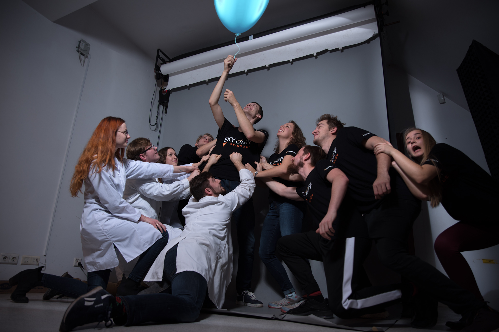

## About

STARDUST Microbiology Project is a joint venture of two Gdańsk University of Technology science clubs: SimLE and KSB (Student Club of Biotechnology). We are group of 10 students from Gdańsk University of Technology in Poland participating in the REXUS/BEXUS programme. Our project aims to conduct qualitative and quantitative research of microbial life in the stratosphere. 

### What is REXUS/BEXUS programme?
The REXUS/BEXUS programme allows students from universities and higher education colleges across Europe to carry out scientific and technological experiments on research rockets and balloons. Each year, two rockets and two balloons are launched, carrying up to 20 experiments designed and built by student teams. 
The REXUS/BEXUS programme is realised organized by a bilateral Agency Agreement between the German Aerospace Center (DLR) and the Swedish National Space Agency (SNSA) in cooperation with European Space Agency (ESA).

### Our abstract
The stratospheric microbiome has been investigated several times using the methods of classical microbiology. In this experiment, we are going to combine them with some novel approaches including whole-metagenome amplification and NGS sequencing. The analysis of metagenome will help to determine the content of various species of bacteria in the sample collected in the stratosphere. Diversification of methods will help to distinguish culturable microorganisms from non-culturable ones. The experiment supplies the information about the possibilities of spreading of bacteria around the world which is important from the point of view of epidemiological threats and environmental biodiversity. It also may provide the scientists with knowledge about the mechanisms of survivability of microorganisms in stratospheric conditions.
In the stratosphere, we expect to find gram-positive bacteria with the ability to survive high doses of UV and cosmic radiation as well as cold, drought or low pressure (incl. low partial pressure of oxygen). After setting up the pure cultures of stratospheric microorganisms, they shall be exposed to different but controlled values of these parameters.
The microorganisms shall be collected in the stratosphere by a sampling system equipped with six filters divided into two subsystems. Two filters shall be placed between ever-closed valves as the control filters. Biological material shall be collected in the remaining four filters of which one shall be used for metagenome isolation. Three of them shall provide the microorganisms for setting up cultures on agar media. One of the control filters shall be treated like the one for metagenome isolation and the second one shall be treated similar to the ones used for setting up the cultures. The stratospheric microbiome shall be compared to the microbiome of the air collected from the place of the balloon’s start.

