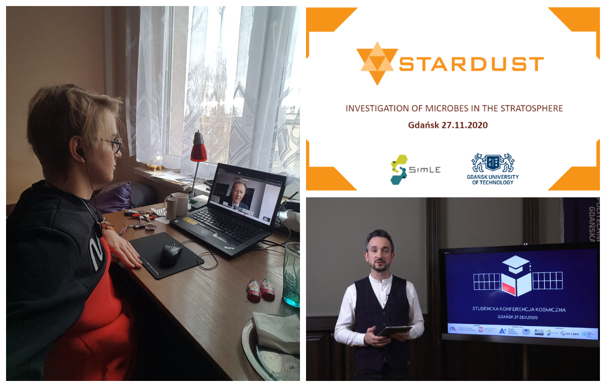
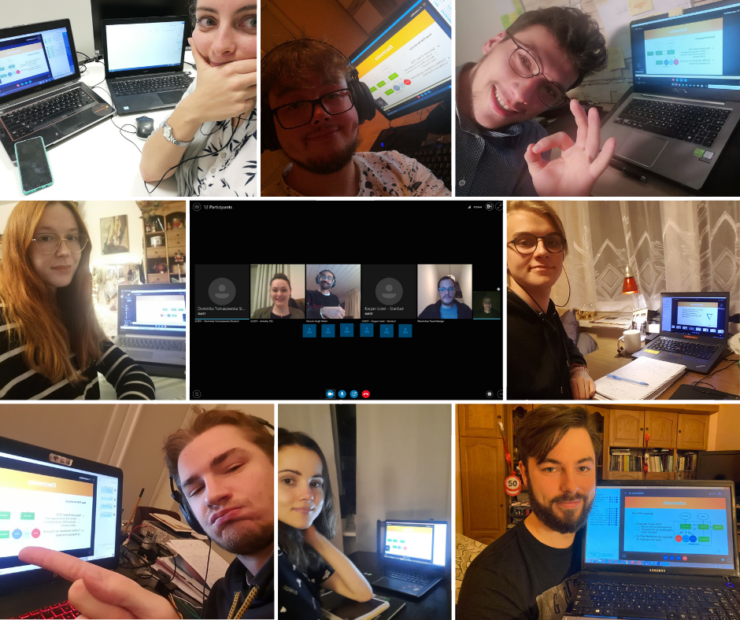
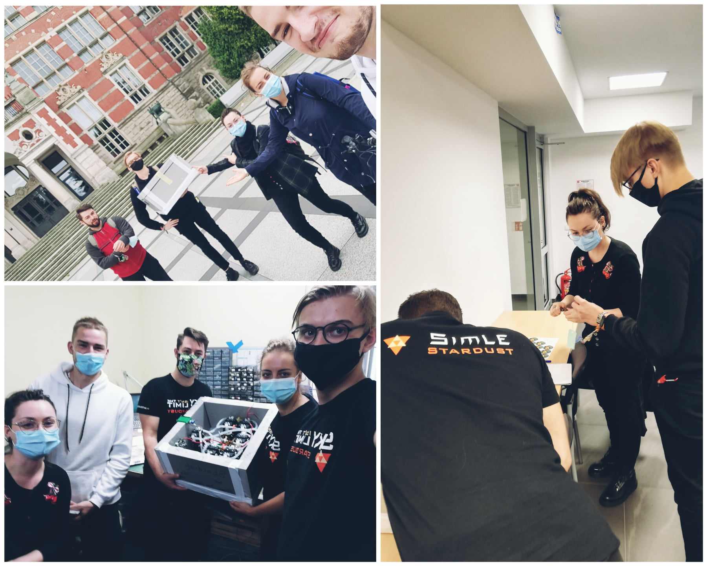
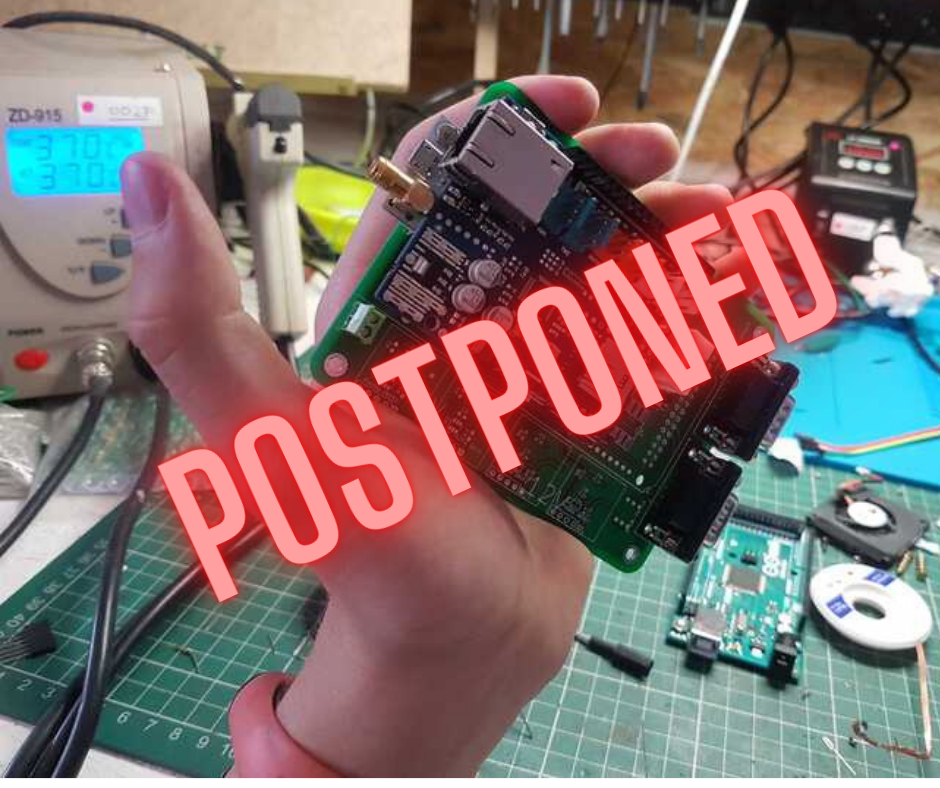
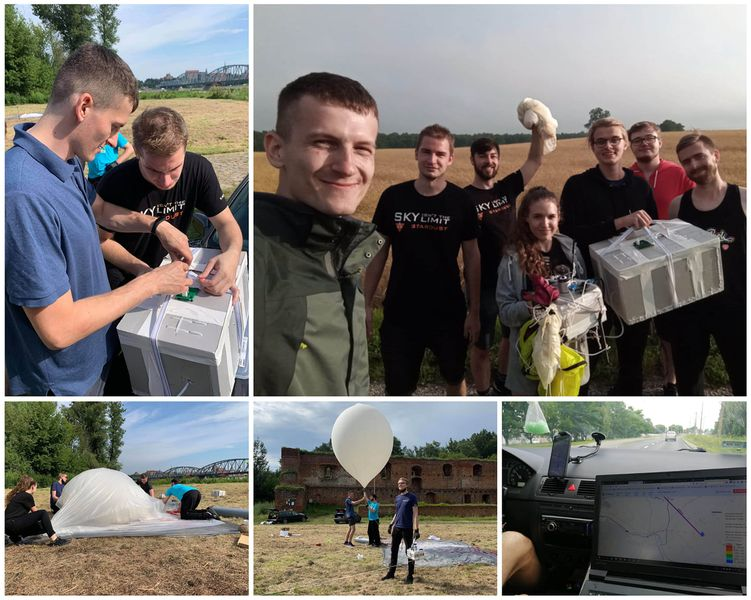
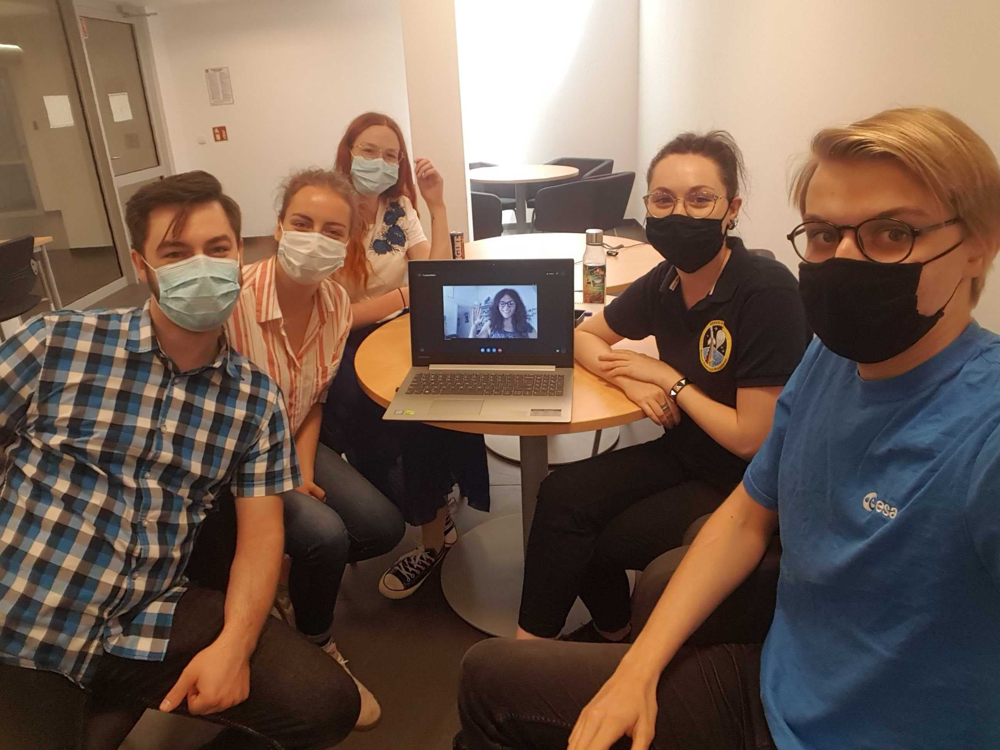
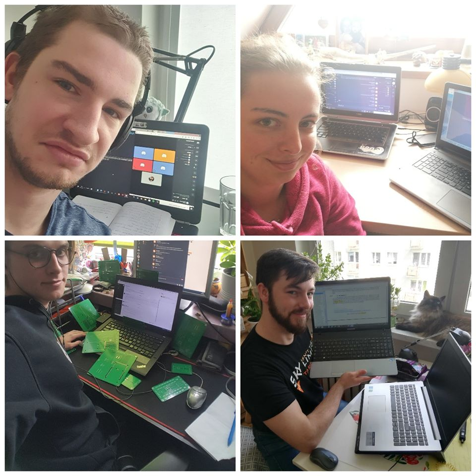

## Blog 

### Online progress review with space experts.

November 2020

How was your Black Friady? Ours not bad at all! 😎 On November 27th, three representatives of Stardust, Paulina, Marcin and Kacper took part in the Student Space Conference. 🛰 During the Student Space Projects panel, we talked about our achievements so far and plans for the future. The event was organized by Polish Space Agecny and Gdańsk University of Technology.

### Online progress review with space experts.

November 2020

We have been working on improving the design of our gondola and electronic solutions for quite some time now. 😃 We have also updated the list of tests that we must complete and along with the schedule 👩‍💻👨‍💻 This is what we talked about with REXUS/BEXUS (Rocket/Balloon Experiments for University Students) program experts yesterday, during our meeting. The changes were approved, we also heard some valuable tips. 😎 So we have nothing else to do but roll up our sleeves and get to work! 💪

### Next step - another visit by an SSC expert.

September 2020

On September  8th, we hosted Armelle Frenea-Schmidt, REXUS/BEXUS program manager from SSC - Swedish Space Corporation, in Gdańsk again. Our experiment has been carefully examined from all angles, we have heard some priceless comments that we are going to to implement! 🧐 As a thank you, we presented to our guest the charms of Gdańsk's old town. 😃 We also presented our progress to ESA representatives in the form of an online conference, during which our mentor, astrobiologist - Nicol Caplin shared her advice with us. 👩‍🔬 Meanwhile, the Stardust project continues! We have to work more on the integration of the system, final tests and prepare of a solid plan for the coming months! 💪

### REXUS/BEXUS campaign postponded to 2021!

August 2020

In the end of August, a very sad news came to us. 😭 
Due to the epidemiological situation, the REXUS/BEXUS launch campaign, which was supposed to take place in Kiruna in October, is postponed to 2021. The organizers made this decision taking into account the health and safety of all participants. That doesn't mean we're going to laze, no, no no! 😎
We've been working very hard on our experiment throughout the summer, and we will continue to improve it to make sure everything works out perfectly during the mission!

### Test mission!

July 2020

Phew! It was a very long Monday. :D On July 20th, we did our test mission! The gondola containing half of the research system rose to a height of 33 km and after a few hours of flight landed on a charming field in a village named Kawle. 😎
It was an important test for us before building the final gondola, that will be flown in the October mission under REXUS/BEXUS (Rocket/Balloon Experiments for University Students).
Now it's time to go to the laboratory! 👩‍🔬👨‍🔬 We will share the results of our mission with you soon! 💪💪

### We are after IPR!

July 2020

We are already after IPR. It was a really valuable experience! Over the past two days, we have presented our progress, planned further activities, and discussed procedures related to the October launch campaign. Armelle Frenea-Schmidt's comments from SSC - Swedish Space Corporation were priceless to us, thank you! As a gratitude, of course, we took our guest on a little trip around Gdańsk Old Town. Our mentor Nicol Caplin from ESA - European Space Agency, was also with us but spiritually and via Skype! Now the most intense month ahead of us! We will test our systems and finish the construction of the gondola. Keep your fingers crossed!

### Separately, but together

May 2020

Separately, but together, we presented our project at the the CDR (Critical Design Review)! During the 20-minute speech, we presented our solutions, created models, analyzes and plans for the near future. However, the most important part was an over-one-hour discussion with the experts of the REXUS/BEXUS (Rocket/Balloon Experiments for University Students), thanks to which we know what to rethink or improve. It was definitely an intensive and well spent time!

### Working during quarantine

Spring 2020

Spring 2020 wasn’t easy time for any REXUS/BEXUS team… Despite this, we tried to work remotely, designing electronics, printing components at home or creating this website :)
In April there was also a very important moment for us - we had the opportunity to meet and for the first time hold a video conference with our BEXUS mentor - Nicol Caplin, astrobiologist from ESA. 

### We are going to Kiruna

February 2020

During the Student Training Week we had an occasion to get to know the cosmodrome, from which we’ll be launching the balloon with our experiment aboard in October. We’ve learned about its buildings, equipment and personnel. We’ve listened to many hours of useful lectures concerning the technical aspects of the balloon mission. We’ve stated the accommodation of our experiment in the balloon’s gondola. We also got to meet the members of other teams, with whom we will cooperate. The most important thing during these days was although the feedback given to us by the experts during our Preliminary Design Review, which let us see our drawbacks in our project documentation. Aside these scientific, technical and other important things, we’ve met some reindeers, visited Kiruna and the Ice Hotel and admired the beautiful northern lights!

### Making our first SED

January 2020

Student Design Review was the biggest documentation, that we have ever made. Our team met several times during winter period to make sure, we’ve included everything necessary in the documentation; our electronic and mechanical solutions as well as an outline of a microbiological experiment and an idea for outreach.

### We passed!

December 2019

After Selection Workshop we were patiently waiting for results and then, at 9th December we got an email! We have become part of REXUS/BEXUS family.

### Stardust at Selection Workshop in ESTEC, Noordwijk

November 2019

In the last week of November we came to Noorwdijk to finally had pleasure to meet ESA members and other REXUS and BEXUS teams. During the selection workshop a total of 13 teams from all over Europe presented their projects as part of the 2nd stage of qualification for the REXUS / BEXUS program. Our Stardust team was the only representative of Poland. Undoubtedly, the most important moment for everyone was the speeches before the panel of experts - our representatives Agnieszka, Dominika, Marcin and Mateusz had 20 minutes of presentation, 20 minutes to answer the questions. It was also great opportunity to get to know ESA history and experience space technologies from the inside.

### We are in REXUS/BEXUS Program! 

Autumn 2019

In the beginning of university semester we prepare application for REXUS/BEXUS Program. Our team of 10 student specialists work hard to put all our thoughts on paper. It was worth it! 
We got an opportunity to share our idea to space industry specialists. 

### The Best of the Best 4.0 program!

Summer 2019

After weeks of preparations the relevant documents, we finally got an results! The Polish Ministry of Science and Higher Education awarded the Stardust project co-financing in the amount of PLN 225,000 (~ EUR 50,000) under the "Best of the Best! 4.0" program!

### Construction of the vacuum chamber

Autumn 2018

Stardust is not just balloon missions! In 2017, we began building a vacuum chamber to test our solutions in a vacuum before they reach the stratosphere. The project was completely accomplished at the end of 2018, and our chamber worked great! 

### First microbiological mission

September 2017

In September 2017 we launched our first microbiological mission from Toruń, Poland. The balloon reached the altitude of almost 30 km. After that, it blew off and fell on the parachute. The landing took place in a small village Kotomierz, on a tree growing next to a small brook

### First mission

April 2016

April the 26th, 2016. Almost exactly four years ago, we had our first balloon mission as Stardust project! At that time, microbiological part was just a loose idea in Karol's head. During the flight, we tested our electronic and structural solutions used in the gondola.

### The very beginning 

Spring 2015

In 2015 in SimLE Science Club at Gdańsk University of Technology, young student Karol Pelzner start project called Stardust! It was begining of space journey in which dozens of students they took their first steps in space world. 

