### Blog 

#### Working during quarantine

Spring 2020

Spring 2020 wasn’t easy time for any REXUS/BEXUS team… Despite this, we tried to work remotely, designing electronics, printing components at home or creating this website :)
In April there was also a very important moment for us - we had the opportunity to meet and for the first time hold a video conference with our BEXUS mentor - Nicol Caplin, astrobiologist from ESA. 

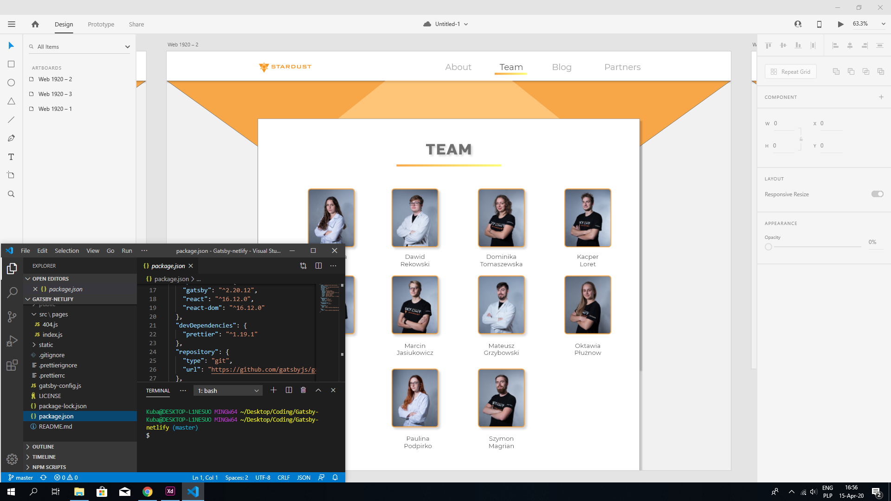

#### We are going to Kiruna

February 2020

During the Student Training Week we had an occasion to get to know the cosmodrome, from which we’ll be launching the balloon with our experiment aboard in October. We’ve learned about its buildings, equipment and personnel. We’ve listened to many hours of useful lectures concerning the technical aspects of the balloon mission. We’ve stated the accommodation of our experiment in the balloon’s gondola. We also got to meet the members of other teams, with whom we will cooperate. The most important thing during these days was although the feedback given to us by the experts during our Preliminary Design Review, which let us see our drawbacks in our project documentation. Aside these scientific, technical and other important things, we’ve met some reindeers, visited Kiruna and the Ice Hotel and admired the beautiful northern lights!

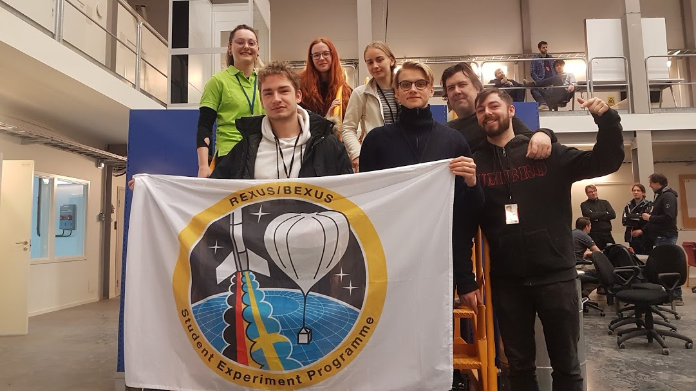

#### Making our first SED

January 2020

Student Design Review was the biggest documentation, that we have ever made. Our team met several times during winter period to make sure, we’ve included everything necessary in the documentation; our electronic and mechanical solutions as well as an outline of a microbiological experiment and an idea for outreach.

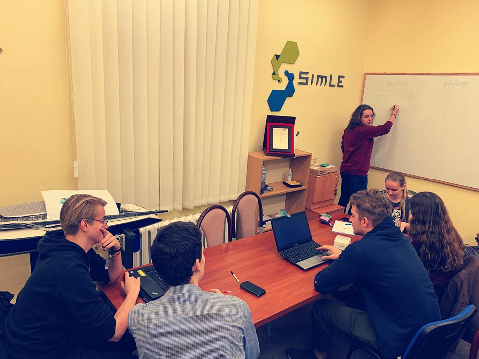

#### We passed!

December 2019

After Selection Workshop we were patiently waiting for results and then, at 9th December we got an email! We have become part of REXUS/BEXUS family.

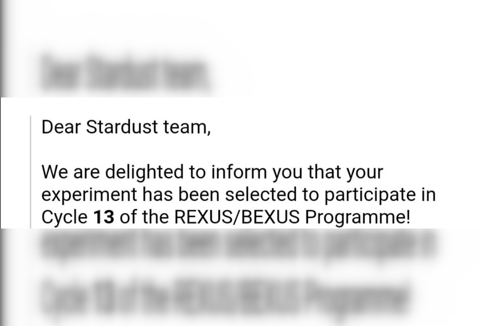

#### Stardust at Selection Workshop in ESTEC, Noordwijk

November 2019

In the last week of November we came to Noorwdijk to finally had pleasure to meet ESA members and other REXUS and BEXUS teams. During the selection workshop a total of 13 teams from all over Europe presented their projects as part of the 2nd stage of qualification for the REXUS / BEXUS program. Our Stardust team was the only representative of Poland. Undoubtedly, the most important moment for everyone was the speeches before the panel of experts - our representatives Agnieszka, Dominika, Marcin and Mateusz had 20 minutes of presentation, 20 minutes to answer the questions. It was also great opportunity to get to know ESA history and experience space technologies from the inside.

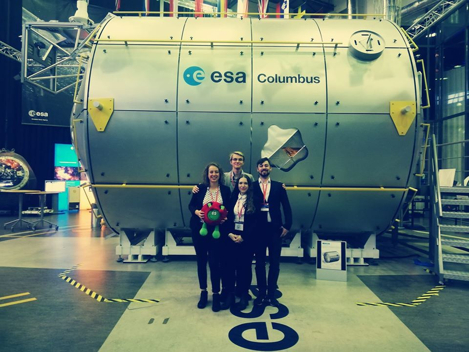

#### We are in REXUS/BEXUS Program! 

Autumn 2019

In the beginning of university semester we prepare application for REXUS/BEXUS Program. Our team of 10 student specialists work hard to put all our thoughts on paper. It was worth it! 
We got an opportunity to share our idea to space industry specialists. 

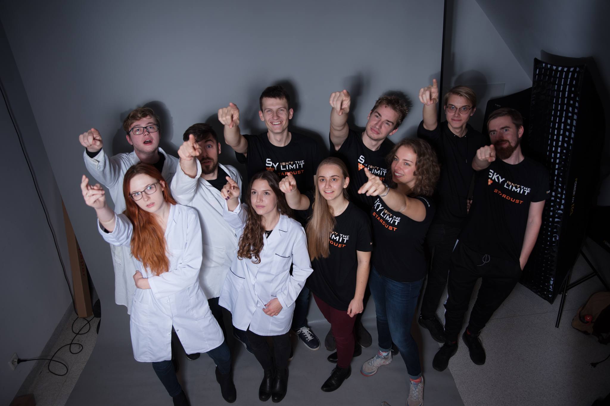

#### The Best of the Best 4.0 program!

Summer 2019

After weeks of preparations the relevant documents, we finally got an results! The Polish Ministry of Science and Higher Education awarded the Stardust project co-financing in the amount of PLN 225,000 (~ EUR 50,000) under the "Best of the Best! 4.0" program!

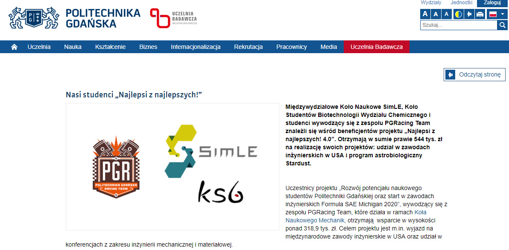

#### Construction of the vacuum chamber

Autumn 2018

Stardust is not just balloon missions! In 2017, we began building a vacuum chamber to test our solutions in a vacuum before they reach the stratosphere. The project was completely accomplished at the end of 2018, and our chamber worked great! 

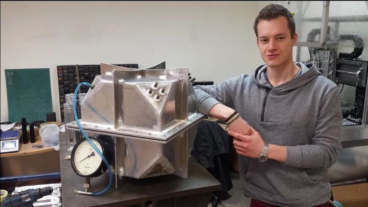

#### First microbiological mission

September 2017

In September 2017 we launched our first microbiological mission from Toruń, Poland. The balloon reached the altitude of almost 30 km. After that, it blew off and fell on the parachute. The landing took place in a small village Kotomierz, on a tree growing next to a small brook

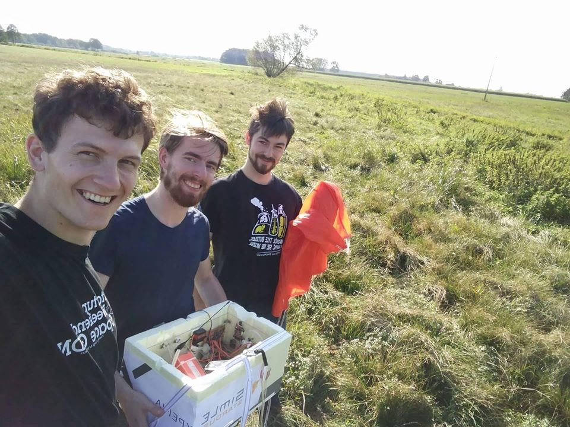

#### First mission

April 2016

April the 26th, 2016. Almost exactly four years ago, we had our first balloon mission as Stardust project! At that time, microbiological part was just a loose idea in Karol's head. During the flight, we tested our electronic and structural solutions used in the gondola.

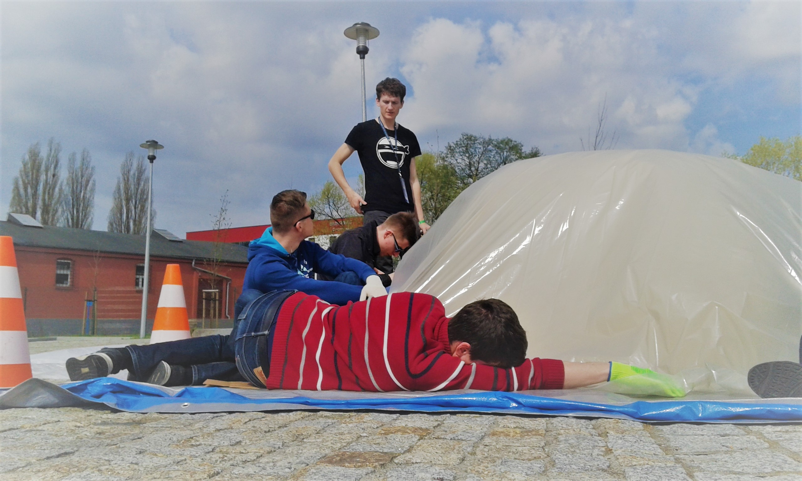

#### The very beginning 

Spring 2015

In 2015 in SimLE Science Club at Gdańsk University of Technology, young student Karol Pelzner start project called Stardust! It was begining of space journey in which dozens of students they took their first steps in space world. 

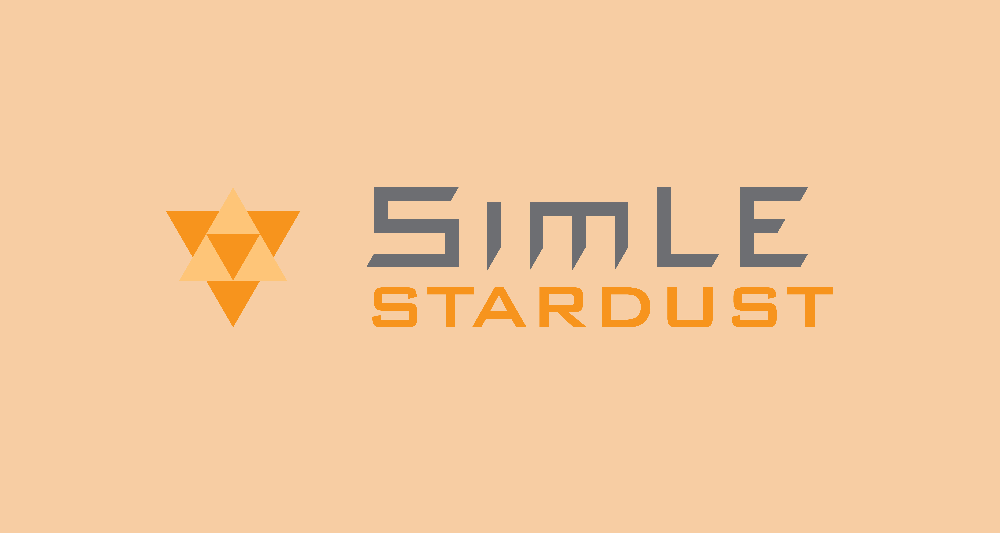
