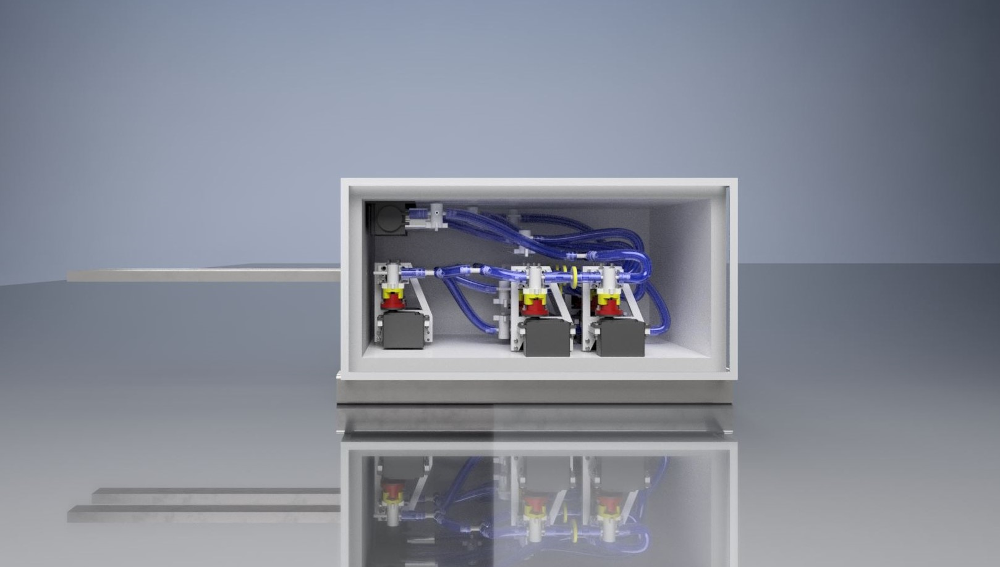
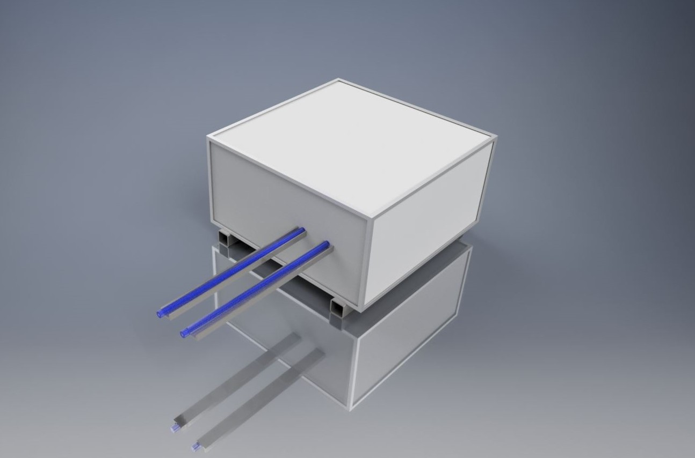
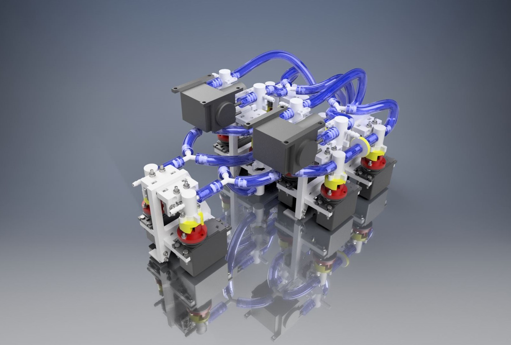
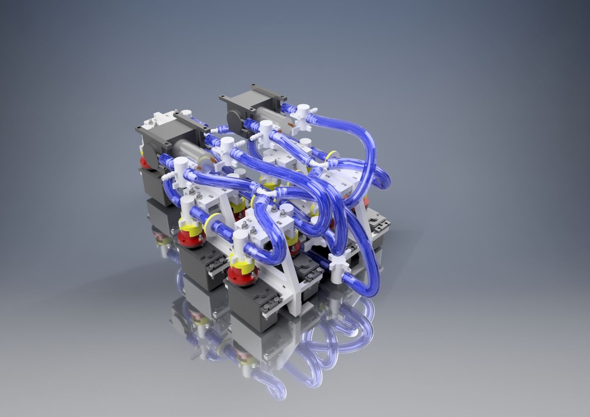
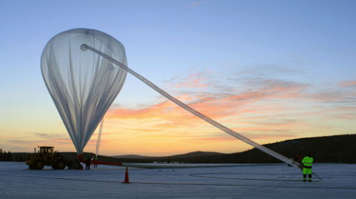
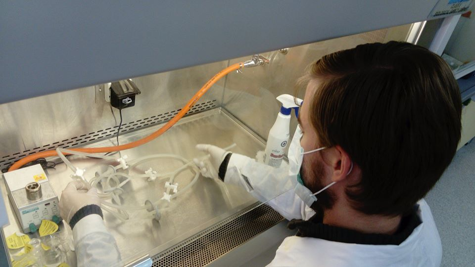
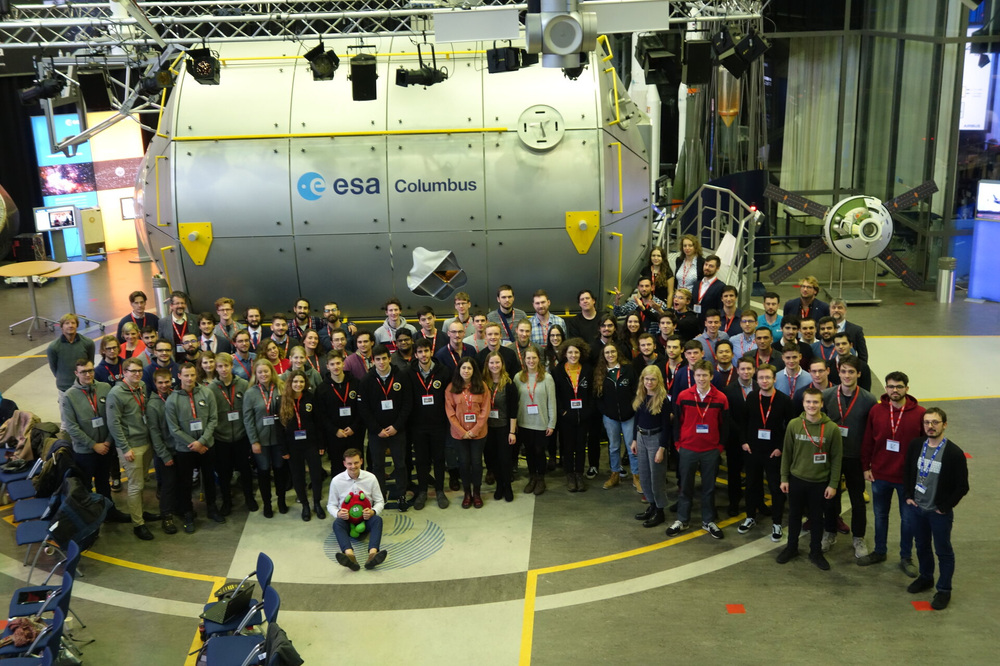

## Inside 

The objective of the experiment is to investigate the microbiome of the stratosphere qualitatively and quantitatively.
The experiment consists of four parts: a filtering system, an electromechanical part operating the filtering system, an electronic system receiving and processing information from the sensors and controlling the electromechanical part and the external isolation made of extruded polystyrene.

 

In this experiment, microorganisms shall be caught in four of six syringe filters put between pressure-tight valves connected by flexible pipes into a filtering system divided into two subsystems. The two remaining filters of the system shall stay between ever-closed valves as the control filters. Two inlets and two outlets of the subsystems (one inlet and one outlet per each subsystem) shall also be controlled by valves. The four valves at the two endings of the system and the eight valves securing the sampling filters shall be operated by servos. Each outlet of the system shall be connected with a diaphragm vacuum pump which shall generate airflow through the filtering system. The valves at the outlet of the system shall be three-way valves, thanks to which the pumps shall suck the air either from the system or directly from the environment depending on the altitude of the balloon holding the experiment. The hoses of the system shall be ramified with inflexible joints. Every component of the filtering system except the syringe filters shall be autoclavable and shall be sterilized directly before the integration of the system. The filters shall be bought sterile. The system shall be integrated in a laminar flow cabinet and shall stay pressure-tight after the integration process. After the integration of the sterile filtering system, before the balloon launch, the inlets of the system shall be covered by the safety caps which shall protect the sections of the inlet pipes between the inlet holes and the first valves from contamination during the process of accommodation of the experiment in the BEXUS gondola. 

 

The pump shall be working during the whole flight, however, the valves of the system shall open after reaching an altitude of 15 km during ascent and close after crossing 18 km of altitude during descent. After the landing of the balloon’s gondola, the filtering system shall be dismounted from the experiment, packed into a safe and clean container and transported immediately to a laminar flow cabinet, where its outer surface shall be decontaminated. Then, still in the laminar flow cabinet, the system shall be packed and sealed in a clean vacuum sack. The temperature of the system during these operations should not exceed the value of 10 ºC. The package with the system shall be transported to the laboratory in Gdańsk in as low temperature as possible. 
During the flight of the balloon with the experiment, the second filtering system similar to that of the main experiment will be running, performing in the same manner, in regular atmospheric air close to Earth’s surface, as a secondary control to compare the results from the stratosphere and the troposphere. All the procedures shall be kept respectively.

After bringing the systems with collected samples to the laboratory, the filters shall be rinsed with proper solutions to wash out the microorganisms from the filters’ membranes. One of the sampling filters and one of the control filters shall be rinsed with a cell lysis buffer after a short incubation with lysozyme and ribonuclease A and then with proteinase K in order to extract total DNA from the collected bacterial cells. Then the DNA shall be purified using a DNA purification kit. The purified DNA shall undergo a multiple-displacement amplification with a Phi29 polymerase which is an isothermal process in which the whole genetic material is multiplied with high fidelity of sequences. The population of the 16S rRNA-coding gene from the amplified metagenome shall be re-amplified in polymerase chain reaction (PCR) and then sequenced in an NGS process on MiSeq apparatus (Illumina) which can output up to 25 millions of gene reads, giving information about the percentage of a given sequence in the population.

Three of the remaining sampling filters and the second of the control filters shall be rinsed with a diluted, isotonic solution of Triton X-100 and sodium chloride in order to rinse out living microorganisms from the filters’ membranes. The suspension of microbial cells shall be centrifuged and the pellet of cells shall be resuspended in a smaller volume of isotonic NaCl solution. After that, the suspensions shall be incorporated onto rich, universal agar media (for example: chocolate agar enriched with vitamins) to set up the microbial cultures. Microorganisms from the three sampling filters shall be cultured in three different aerobic conditions: aerobic, anaerobic and microaerobic. From each primary culture, the pure strains of bacteria, yeast and molds shall be isolated and re-cultured on a proper medium in proper conditions. The cultures of pure strains shall be passaged and then they shall undergo tests. The tests include culturing the microorganisms in different values of temperature, pressure, humidity and concentration of additives to microbiological media as well as treating them with different doses of UV radiation, ionising radiation and oxygen in order to determine their survivability in harsh conditions.

