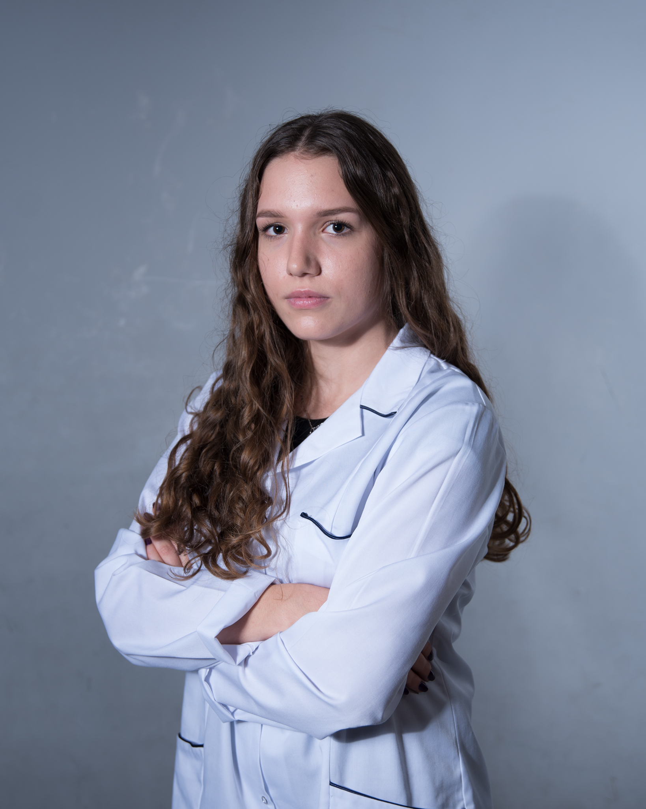
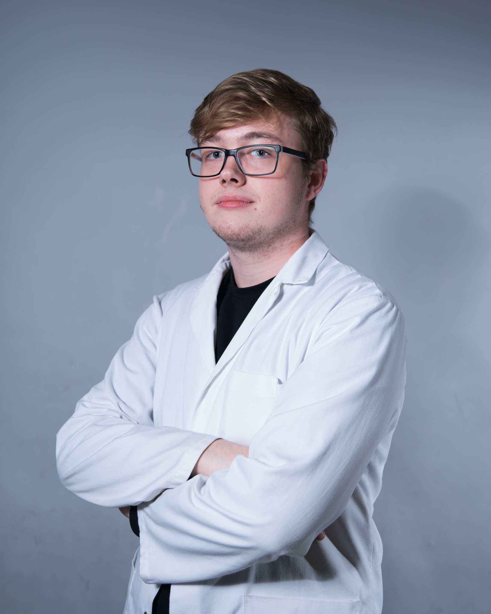
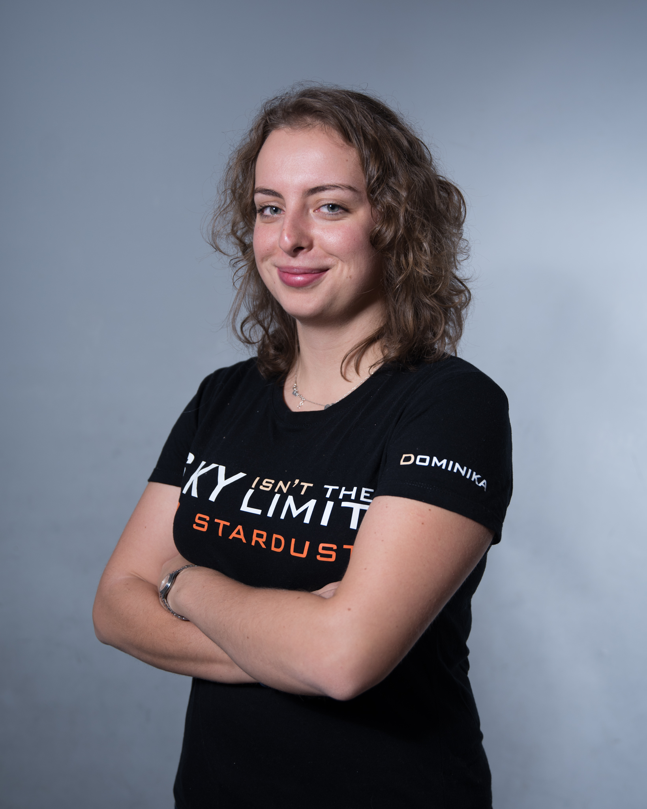
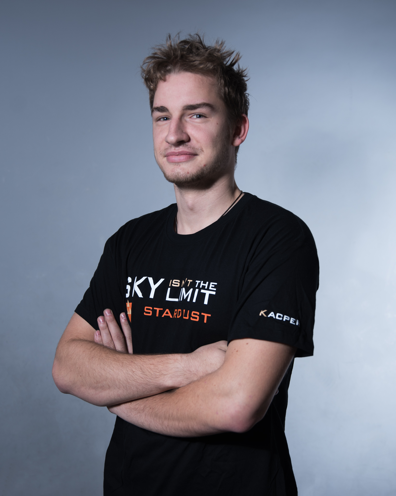
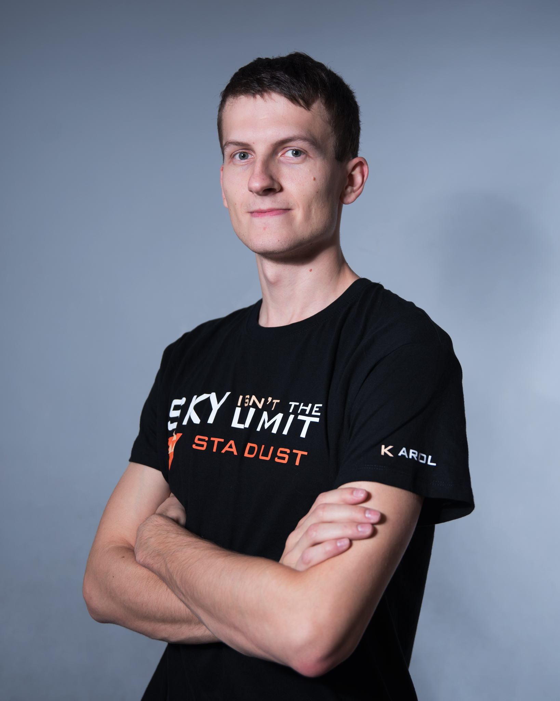
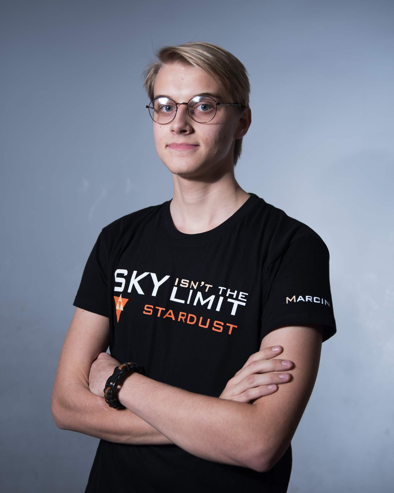
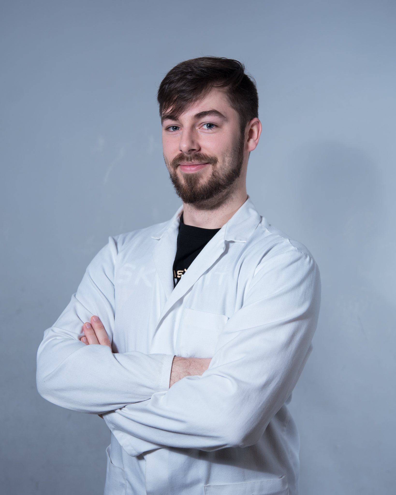
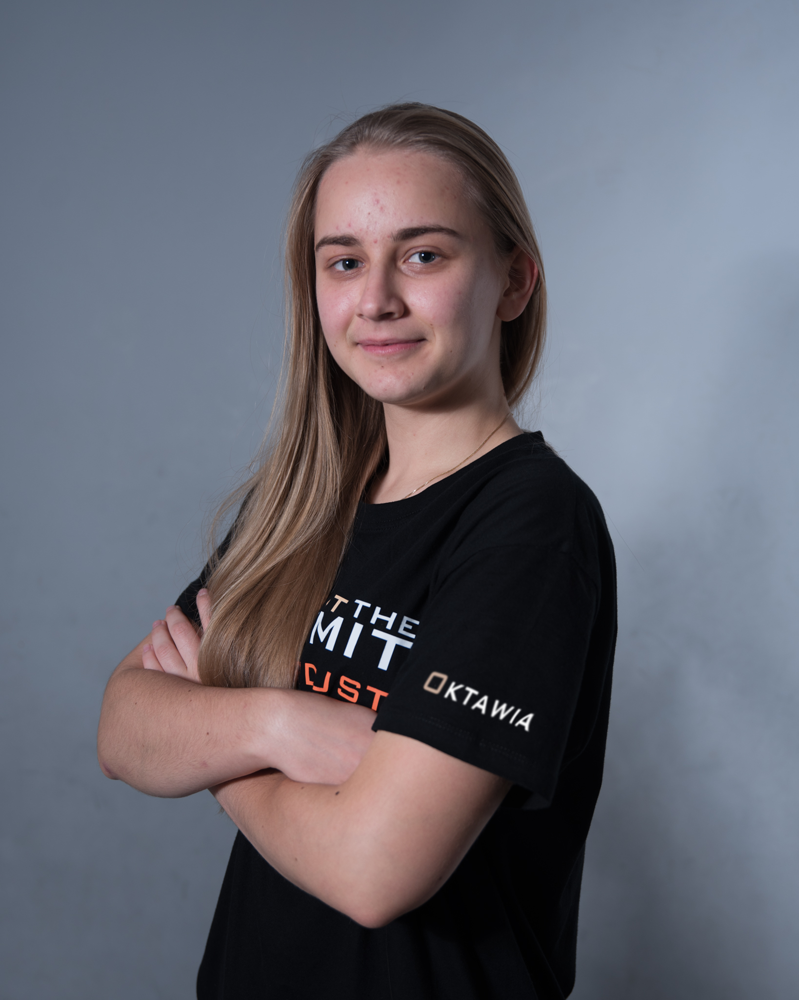
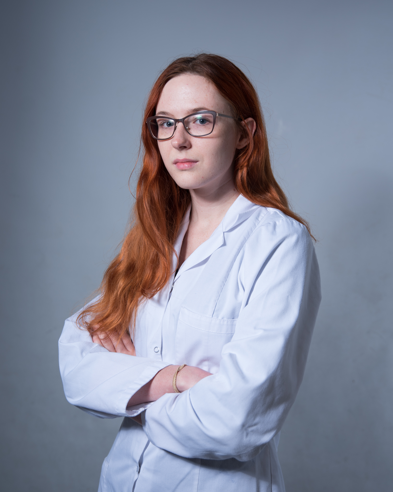
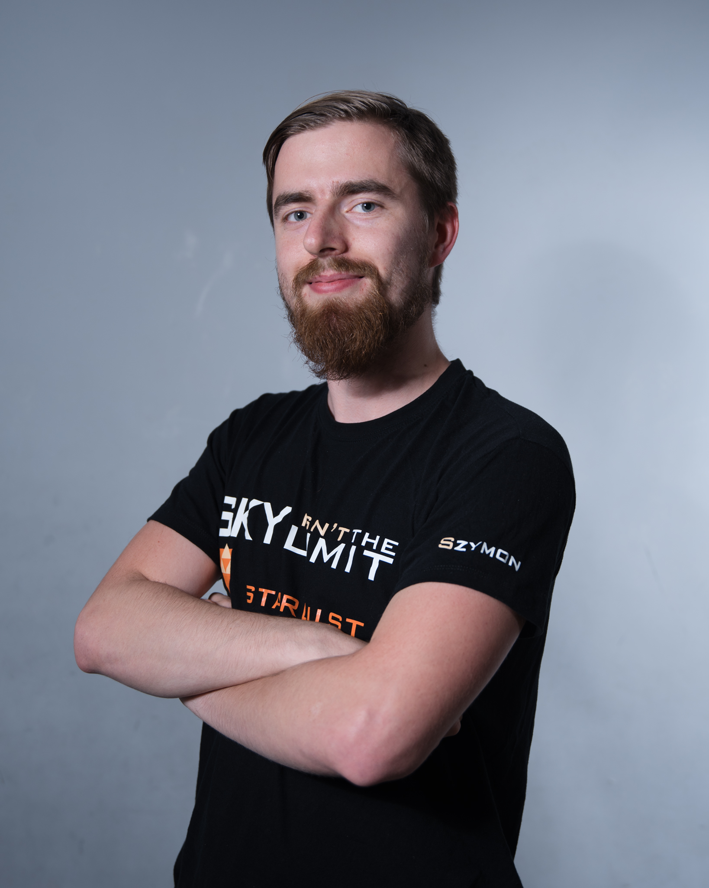

## Team

Agnieszka Kurdyn

Agnieszka is our next microbiologist, a future Biotechnology engineer. She makes herself known as an owner of long curly hair, playing ukulele, reading books or walking in the mountains in her spare time. Her favourite food is pierogi ruskie.

Dawid Rekowski

Dawid is a member of the microbiology team and a student of Biotechnology. Together with the other three students of the Faculty of Chemistry, he will be responsible for the experimental part of the Stardust project. Dawid is interested in football, and during his spare time he likes to play Ludo on a messenger or translates posts into English. Favorite food: toast sandwiches with salami.

Dominika Tomaszewska

Dominika is in charge of social media, promotion, finance and all sorts of paperwork in Stardust project. She has been working at SimLE since 2015, currently as a Chairman. She is a student of Mechanics and Machine Design, and volleyball player, also a fan of ski jumping, ABBA and the Friends series. One day she will scratch off all countries on her scratch map. Favorite food: Silesian dumplings.

Kacper Loret

Kacper is our mechanical specialist, an expert in fluid mechanics. He designed our bacterial collection system! Fan of tourism, secrets of photography and car mechanics. In his spare time he eats spaghetti carbonara.

Karol Pelzner

This mister probably doesn't need to be introduced to anyone! The real Team Leader! In our squad, he performs the function of a Hardware Design Engineer. Karol joined SimLE while being in high school and he has been leading the section of stratospheric balloons since 2015. Now he's bound to the Faculty of Electronics, Telecommunication and Informatics. Always fascinated by new technologies and exploring the most remote parts of the world. Favourite food: Chineese style meat.

Marcin Jasiukowicz

Calls himeself a "tinkerer obsessed with space", big fan of SpaceX and space technologies. Will spot a Tesla car from a mile away. Marcin is our Firmware Enginieer working on the technical side of the Stardust mission. He loves pizza and 0.99€ chicken nuggets from Burger King.

Mateusz Grzybowski

Mateusz is a leader of the Microbiology Team. He studies Biotechnology at Faculty of Chemistry. Together with Karol, he created the perspective of microbiological balloon missions. Privately a fan of cooking and enology (you need to google that - life's hard!). He loves to eat sushi and to make sushi because his favourite dish is... Guess what!

Oktawia Płużnow

Oktawia is another representative of the '99 generation in Stardust. She is connected with the project from the beginning of her student adventure. A future mechatronics engineer with a penchant for programming. A fan of space, climbing. In the future she is going to learn how to fly gliders. Enthusiast of red borscht with dumplings.

Paulina Podpirko

Paulina is a member of the microbiology team and like the other members of this group, a student of Biotechnology. She is interested in cosmetics chemistry and production of home-made wine (we are waiting for invitation to test it). Favorite food: French fries

Szymon Magrian

Szymon is our leading Embedded Firmware Engineer. Associated with Stardust for years, student at the Faculty of Electronics, Telecommunication and Informatics Department, one of the most experienced project members. Fascinated by the musical creativity of Mr. Jacek Stachursky. A fan of good memes and a great gourmet. His favorite dishes are donatello pizza from Biedronka and lumberjack sandwich from McDonald.